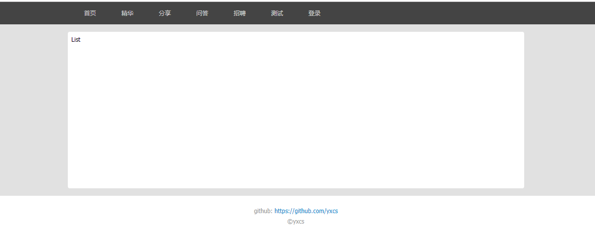

### 项目介绍
使用 create-react-app 构建一个 react 项目的基础架构  
包括: 
- react-router4.0 的使用 
- - axios 获取远程api内容
- 从 flux -> redux -> redux-thunk -> redux-sage -> mobx 迁移转变的过程
- antd UI 组件的添加
- ...
### 项目安装
```shell
git clone ''  
cd react-state-machine  
npm i  
npm start  
```
可以直接在 github 上拷贝这个项目
同时，也可以按照我搭建的过程，一步一步的跟着构建

### 基础项目搭建
确保你的电脑上安装了 npm 和 node  
1. 首先需要全局安装 reate-react-app 
   ```shell
    npm install -g create-react-app
   ```
   or
   ```shell
    npm install -g yarn  
    yarn add -g create-react-app
   ```
   完成之后，就开始生成一个react项目
   ```shell
    create-react-app react-state-machine
    cd react-state-machine
    npm start
   ```
   需要等待一会儿，会自动把需要的插件安装好，插件包括 react, react-dom, react-scripts。这个时候我们可以看到，项目已经运行了，在浏览器中打开项目，地址为 http://localhost:3000/ (默认端口 3000)，你会看到一个旋转的logo。  
     
2. 现在我们已经有了一个基础的react项目了，但是目前只有一个url http://localhost:3000/ 没有其他的了。以前的路由是由后端控制的，每个路由对应一个单独的页面，切换路由就可以在服务器上拿到不同的页面了，但是 react 框架一般是用来实现单页面应用的，即 SPA，那么它的路由就与传统的有些不同。它是由 H5 的history控制的，对应的不是页面而是组件。  
   为了实现前端路由，这里使用了 React-router
   React-router 提供了一些router的核心api，包括Router, Route, Switch等，但是它没有提供dom操作进行跳转的api。
   而 React-router-dom 提供了BrowserRouter, Route, Link等api ,我们可以通过dom的事件控制路由。例如点击一个按钮进行跳转，大多数情况下我们是这种情况，所以在开发过程中，我们更多是使用React-router-dom。
   ```shell
    npm i react-router-dom
   ```
   React-router-dom 的两个基础组件：HashRouter 和 BrowserRouter
   HashRouter：以hash值来对路由进行控制，路由是这样的 http://localhost:3000/#/test
   BrowserRouter：HashRouter这样的路由很奇怪，和我们平时看到的不一样，如果想和以前的保持一样，那么，就用BrowserRouter来实现。它的原理是使用HTML5 history API (pushState, replaceState, popState)来使你的内容随着url动态改变的， 如果是个强迫症或者项目需要就选择BrowserRouter吧。
   - 在src/目录下新建一个目录components/用于存放各种组件，在src/components/下新建多个文件，如下：
    ```html
    src
      |- components
        |- Article.js
        |- Author.js
        |- Content.js
        |- Footer.js
        |- Header.js
        |- List.js
        |- Login.js 
    ```
    接下来我们开始改造 src/App.js 文件。将原有代码删除，将以下代码添加到App.js中：
    ```javascript
        import React, { Component } from 'react';
        import { BrowserRouter } from 'react-router-dom';

        import Article from './components/Article';
        import Author from './components/Author';
        import Content from './components/Content';
        import Footer from './components/Footer';
        import Header from './components/Header';
        import List from './components/List';
        import Login from './components/Login';

        class App extends Component {
            constructor(props) {
                super(props);
            }

            render() {
                return (
                    <BrowserRouter></BrowserRouter>
                )
            }
        }

        export default App;
    ```
    从 react-router-dom 中引入 BrowserRouter，并将其在render中返回，导入components中的组件。接下来是添加router的主要内容:  

    App.js  
    ```javacript
        return (
        <BrowserRouter>
            <div>
            <Header></Header> {/* 头部导航内容 */}
            <Content>         {/* Content来规范主题内容的整体样式，包含路由内容 */}
                <Switch>        {/* 用来渲染匹配地址的第一个<Route>或者<Redirect> */}
                <Redirect exact from="/" to="/home/all" />              {/* <Redirect> 跳转到home */}
                <Redirect exact from="/home" to="/home/all" />
                <Route path='/home/:tab' component={List}></Route>       {/* 匹配路由为 /home 的请求，显示List组件 */}
                <Route path='/article/:id' component={Article}></Route>
                <Route path='/author/:id' component={Author}></Route>
                <Route path='/login' component={Login}></Route>
                </Switch>
            </Content>
            <Footer></Footer> {/* 页脚 © copyright等信息 */}
            </div>
        </BrowserRouter>
        )
    ```
    Content.js  
    ```javascript
        import React, { Component } from 'react';

        class Content extends Component {
            constructor(props) {
                super(props);
            }

            render() {
                return (
                <div>
                    Content
                    {this.props.children}
                </div>
                )
            }
        }

        export default Content;
    ```
    List.js 和 components下的其他js文件(将List替换成其他的组件名即可)
    ```javascript
        import React, { Component } from 'react';

        class List extends Component {
            constructor(props) {
                super(props);
            }

            render() {
                return (
                    <div>
                        List
                    </div>
                )
            }
        }

        export default List;
    ```
    这时我们打开 http://localhost:3000/，会自动跳到 http://localhost:3000/home，显示的内容如下：
    
      

    有点丑啊，加点样式吧，在 App.js 中添加 import './App.css';，在App.css中加入相应样式，在Header.js中添加一些导航信息:
    ```javascript
        import React, { Component } from 'react';
        import { Link } from 'react-router-dom';
        class Header extends Component {
            constructor(props) {
                super(props);
            }

            render() {
                return (
                <div className="header__wrap">
                    <div className="header__menu">
                    <div><Link to="/home/all">首页</Link></div>
                    <div><Link to="/home/good">精华</Link></div>
                    <div><Link to="/home/share">分享</Link></div>
                    <div><Link to="/home/ask">问答</Link></div>
                    <div><Link to="/home/job">招聘</Link></div>
                    <div><Link to="/home/test">测试</Link></div>
                    <div><Link to="/login">登录</Link></div>
                    </div>
                </div>
                )
            }
        }

        export default Header;
    ```
    效果如下:

        

    点击头部导航切换不同的路由，再添加页面时只需在App.js中添加新的 Route 就好了

3. 现在有一个问题，页面都是空的没有任何数据，这里我们调用 [Cnode 社区](https://cnodejs.org/ "Cnode 社区") 的开放的API来填充我们的项目
   这里使用axios来调用远程API
   ```shell
    npm i axios
   ```
   在src下新建config.js文件和services/apis.js文件
   config.js
   ```javascript
    // 基础URl
    export const BASE_URL = 'https://cnodejs.org/api/v1';
  ```
  在services/apis.js中添加所有用到的api，具体的内容和传参等请 [点击这里](https://cnodejs.org/api "Cnode Api") 查看：
  apis.js
  ```javascript
    import axios from 'axios';
    import { BASE_URL } from '../config';

    const filterNullParams = (params) => {
        let newParams = {};
        let isArray = false;
        Object.keys(params).forEach(key => {
            isArray = Object.prototype.toString.call(params[key]).indexOf('Array') !== -1;
            if ( (isArray &&
            params[key].length >0) ||
            (!isArray && (!!params[key] ||
            params[key] === 0 ||
            params[key] === false)) ) {
            newParams[key] = params[key];
            }
        });
        return newParams;
    }

    const params2String = (params) => {
        let str = '';
        for (let key in params) {
            str += `&${key}=${params[key]}`
        }
        str = str.replace('&', '');
        return str;
    }

    //get /topics 主题首页
    export const getTopics = (params) => {
        const newParams = filterNullParams(params);
        const str = params2String(newParams);
        return axios.get(`${BASE_URL}/topics`, {
            ...newParams
        })
    }
  ```
  在 List.js 中调用apis.js 中的函数，获取相应数据：
  ```javascript
    import React, { Component } from 'react';
    import { getTopics } from '../services/apis';
    class List extends Component {
        constructor(props) {
            super(props);
        }

        componentWillMount() {
            const params = {
            page: 1,
            tab: 'all',
            limit: 40,
            mdrender: true
            }
            getTopics(params).then(res => {
                console.log(res)  // 输出返回的数据
            })
        }

        render() {
            return (
            <div className="list__wrap">
                
            </div>
            )
        }
    }

    export default List;
  ```

4. 数据有了，还缺展示数据的样式，可以添加react的UI组件，这里添加的是 antd
   ```shell
    npm i antd --save                      # antd UI 组件
    npm i react-app-rewired --save-dev     # 使用 react-app-rewired 对create-react-app进行配置
    npm i babel-plugin-import --save-dev   # 按需加载
    npm i react-app-rewire-less --save-dev # 增加less支持， 更改主题颜色等
   ```
   在src下面新建 config-overrides.js，并添加配置设置
   ```javascript
    const { injectBabelPlugin } = require('react-app-rewired');
    const rewireLess = require('react-app-rewire-less');

    module.exports = function override(config, env) {
        config = injectBabelPlugin(
            ['import', { libraryName: 'antd', libraryDirectory: 'es', style: true }], // change importing css to less
            config,
        );
        config = rewireLess.withLoaderOptions({
                modifyVars: { "@primary-color": "#1DA57A" },
                javascriptEnabled: true,
            })(config, env);
        return config;
    };
    ```
    更改package.json中项目启动脚本
    ```json
    "scripts": {
        "start": "react-app-rewired start",
        "build": "react-app-rewired build",
        "test": "react-app-rewired test",
        "eject": "react-scripts eject"
    }
    ```
